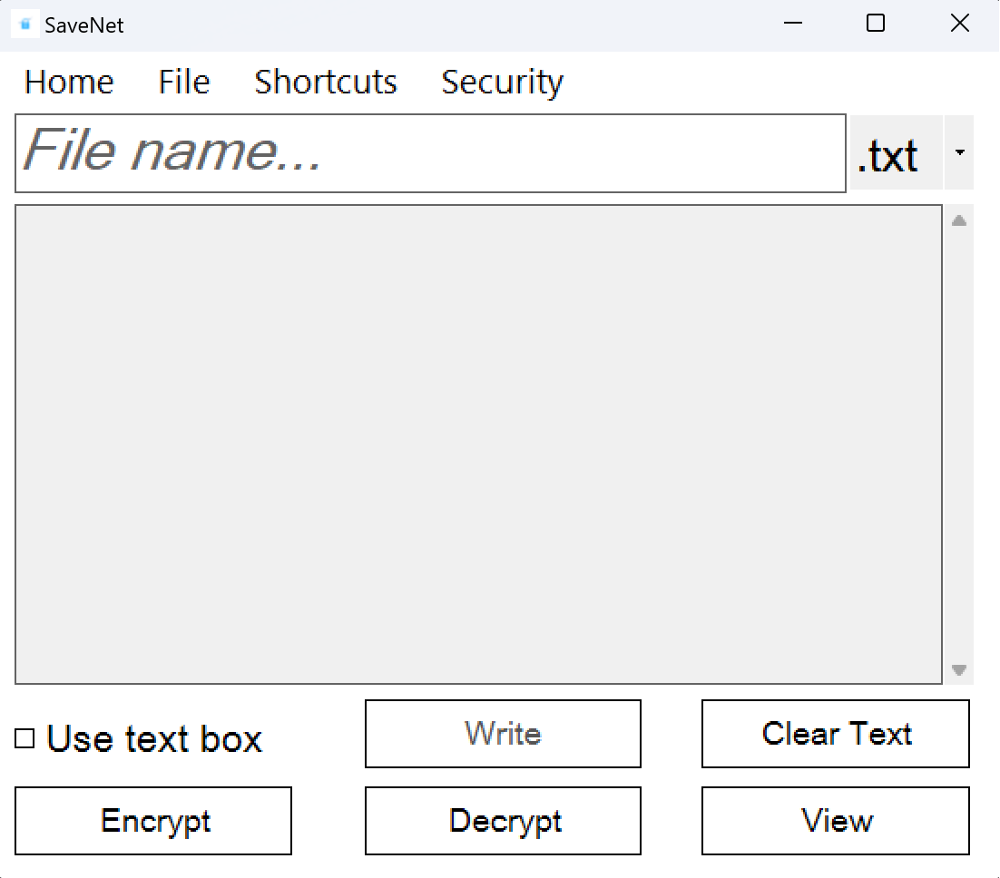

# SaveNet

Secure your files with SaveNet. With its GUI created in CLI it's more easy to secure yourself.\
Main features are encrypt, decrypt, .sn extension, view, clear & create file.

# Functions

- Encrypt file
- Decrypt file
- Generate secure file
- Clear, delete, view, write to file
- .sn extension use
- Shortcuts

# Encrypt & Decrypt

To encrypt & decrypt this project use an algorithm.
This algorithm take a letter and convert into an ASCII code added by a calculation process.

# TO DO

- [ ] Dark theme
- [ ] Manage theme
- [x] Default theme reconfig
- [x] Local password
- [x] Get local user name to login
- [x] New create file function
# Notice

This application is only for educational proposal and if you really want to use this app wait for the MAIN RELEASE.
